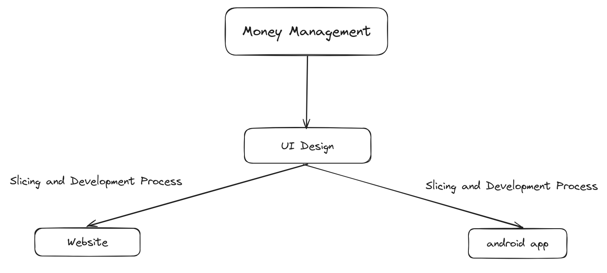
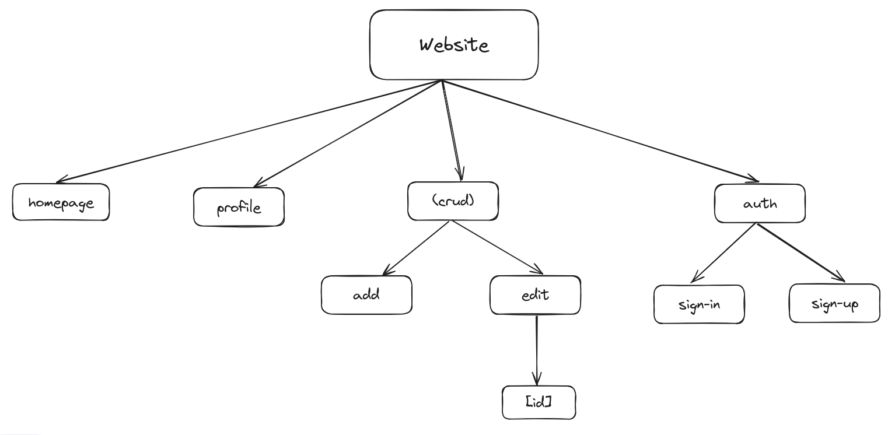

  <h1>Money Management</h1>
  
Money Management is a Web Application to manage your income and expenses.

## Note

This project is optimized for mobile device!

## About

Initially, this project is created as an assignment for mobile programming subject in my college. Me and two of my friends are assigned to make an Android app, along with the UI Design. But then my lecturer said that if we create the Website version too, it'll be a plus for us. So, here I am, as a UI Designer and Frontend Developer, developing UI Design and Website version of this project. Android app versions are developed by my friend.

## Development Process

## Website Structure

## Features

- Add new expenses/income
- Delete history expenses/income
- Edit history expenses/income
- User profile
- Dark mode switcher
- Sign in and Sign up

## Tech Stack

- Next JS
- Typescript
- Uno CSS
- Firebase
- Zustand
- tRPC
- React Query
- React Hook Form

## Screenshots

## Videos

## Getting Started

- Clone this repo.
- Fill all needed env variables. You can see my env format in file `.env.example`.
- Install all dependencies. I use `pnpm`. So, i can type `pnpm install`.
- After that, run `pnpm run dev` in your terminal and you're ready to go.

## License

MIT
